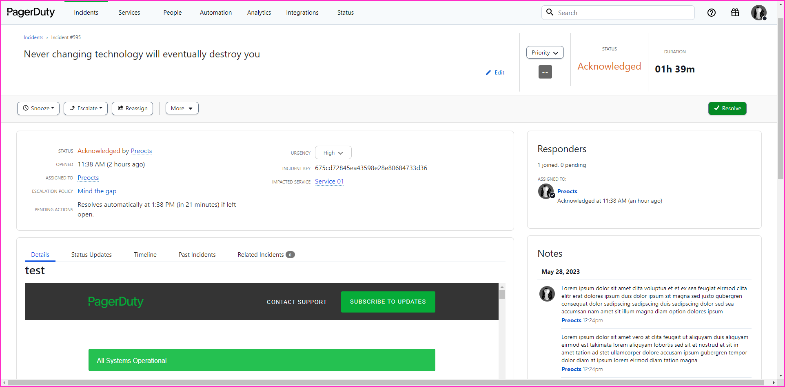
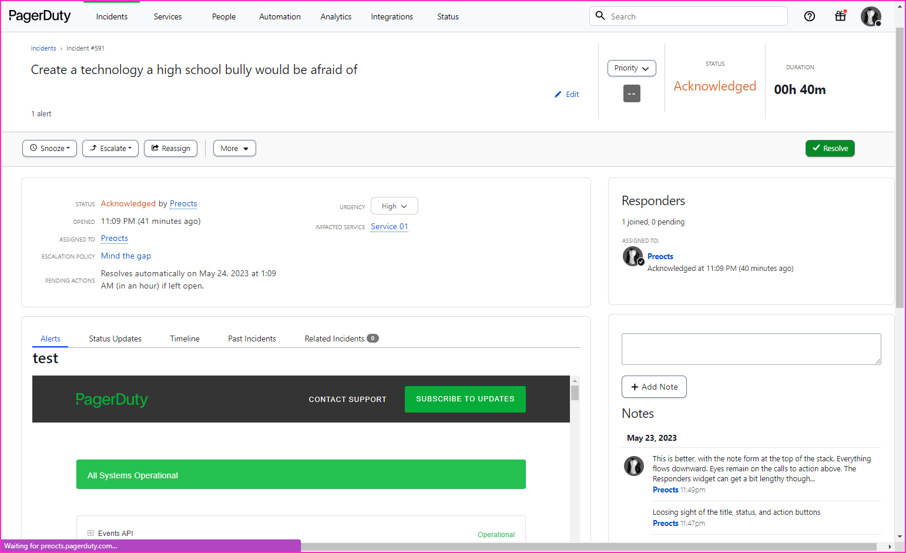
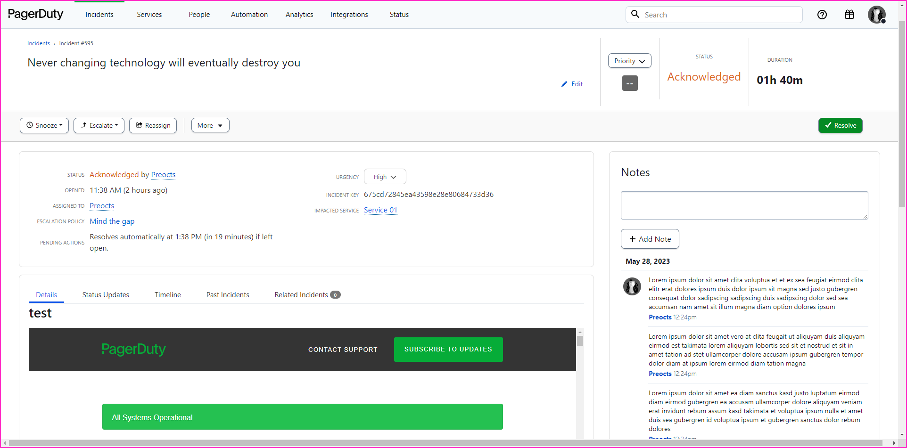
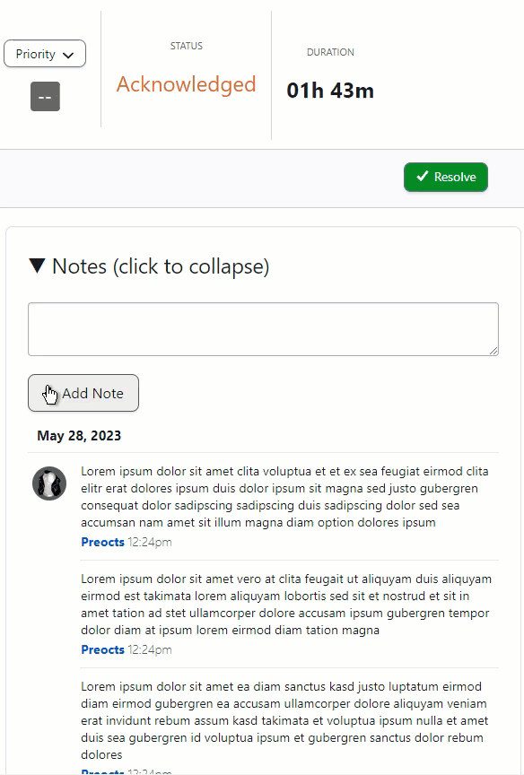

# pdui-scripts

User scripts created to adjust the layout of PagerDuty's UI for a more
functional user experience.

## Requirements:

These scripts require a browser extension to manage. They are designed for
Chrome or Firefox.

- google chrome uses
  [tampermonkey](https://chrome.google.com/webstore/detail/tampermonkey/dhdgffkkebhmkfjojejmpbldmpobfkfo?hl=en)
- firefox uses
  [greasemonkey](https://addons.mozilla.org/en-US/firefox/addon/greasemonkey/)

Once you have the extension installed, click on the "install" link for a user
script. The extension will prompt for installation from the raw content link
based on the filename.

---

## noteform-on-top.user.js

This moves the note textbox and submit button to the top of the note widget. As
notes are listed newest to oldest it makes sense to keep the input box at the
top for visability.

[Install by clicking
here](https://github.com/Preocts/pdui-scripts/raw/main/noteform-on-top.user.js)

## notewidget-on-top.user.js

This moves the entire note widget to the top of the right-hand column placing it
above the responder widget. This is ideal to keep the most recent notes as calls
to action while maintaining awareness of status, title, and action buttons.

[Install by clicking
here](https://github.com/Preocts/pdui-scripts/raw/main/notewidget-on-top.user.js)

---

### Before plugins:

### After noteform-on-top.user.js

### After notewidget-on-top.user.js

### With colaspable-widgets.user.js

---
